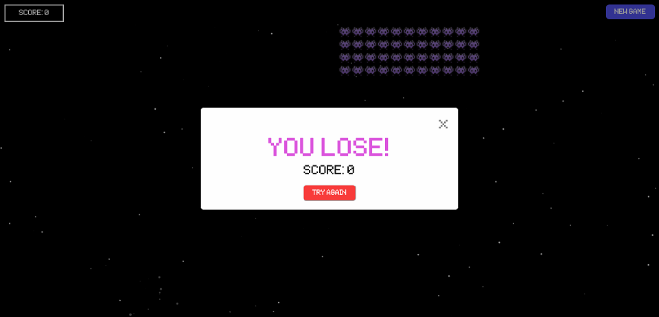
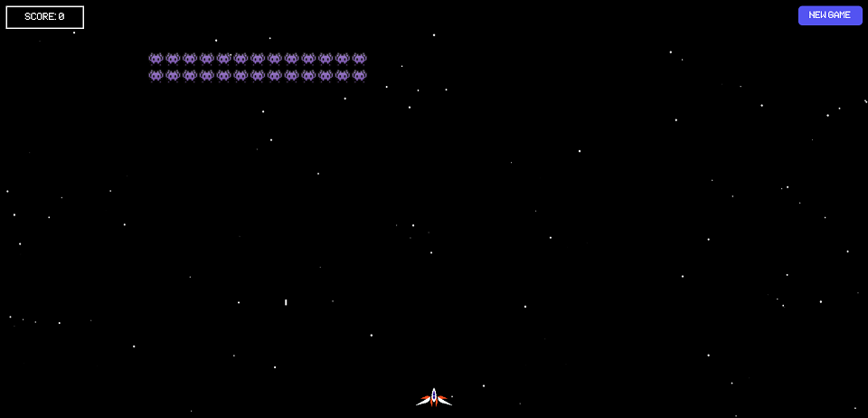

# Space Invader Game (HTML/SCSS/JS)

A clone of an arcade game called Space Invaders.

## Screenshots

 \

## Links

- Solution URL: [Solution]()
- Live Site URL: [Live Site]()

## References

- [Space Invader font](https://thefontsmagazine.com/font/space-invaders-font/) - link on where to download a space invader font.
- [Space Invaders Color Scheme](https://www.schemecolor.com/classic-space-invaders.php) - guide for space invader color scheme.
- [Import custom font](https://css-tricks.com/snippets/css/using-font-face-in-css/) - guide on implementing custom font.
- [Fix on importing custom font](https://programmerah.com/css-failed-to-decode-downloaded-font-ots-parsing-error-failed-to-convert-woff-2-0-font-to-sfnt-23234/) - a guide on fixing import for a custom font (if necessary).
- [Webpack 5 Crash Course](https://youtu.be/IZGNcSuwBZs) - a crash course on webpack 5.
- [Load custom font using Webpack](https://webpack.js.org/guides/asset-management/#loading-fonts) - guide on how to load custom font using Webpack.
- [Webpack production & development mode](https://webpack.js.org/guides/production/) - build your app for production and development using webpack.

## Author

- Website - [Fidel Lim](https://fidellim-portfolio.netlify.app/)
- Frontend Mentor - [@fidellim](https://www.frontendmentor.io/profile/fidellim)
- Github - [@fidellim](https://github.com/fidellim)
